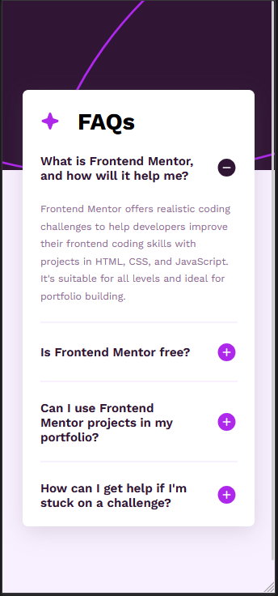
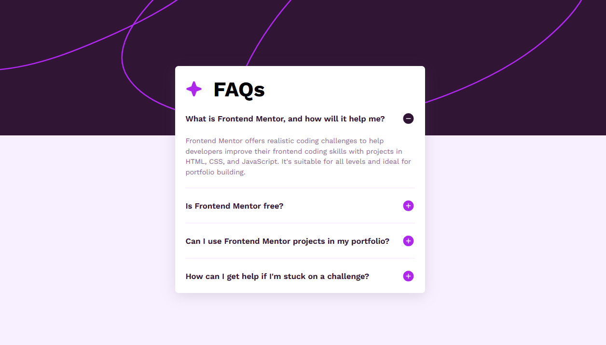
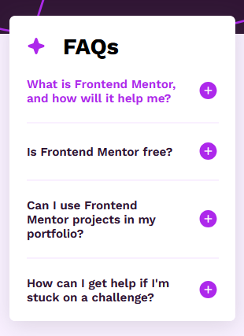

# Frontend Mentor - FAQ accordion solution

This is a solution to the [FAQ accordion challenge on Frontend Mentor](https://www.frontendmentor.io/challenges/faq-accordion-wyfFdeBwBz). Frontend Mentor challenges help you improve your coding skills by building realistic projects. 

## Table of contents

- [Overview](#overview)
  - [The challenge](#the-challenge)
  - [Screenshot](#screenshot)
  - [Links](#links)
- [My process](#my-process)
  - [Built with](#built-with)
  - [Useful resources](#useful-resources)
- [Author](#author)

**Note: Delete this note and update the table of contents based on what sections you keep.**

## Overview

### The challenge

Users should be able to:

- Hide/Show the answer to a question when the question is clicked
- Navigate the questions and hide/show answers using keyboard navigation alone
- View the optimal layout for the interface depending on their device's screen size
- See hover and focus states for all interactive elements on the page

### Screenshot

Mobile Design:

Desktop Design:

Hover State:

### Links

- Solution URL: (https://github.com/CHarvey820/faq-accordion-main)
- Live Site URL: (https://charvey820.github.io/faq-accordion-main)

## My process

### Built with

- Semantic HTML5 markup
- CSS custom properties
- Flexbox
- Details/Summary Keyboard navigable components
- Mobile-first workflow

### Useful resources

- [Resource 1](https://www.smashingmagazine.com/2022/11/guide-keyboard-accessibility-html-css-part1/) - Referenced the accordion navigation section

## Author

- GitHub - [CHarvey820](https://github.com/CHarvey820)
- Frontend Mentor - [CHarvey820](https://www.frontendmentor.io/profile/CHarvey820)
